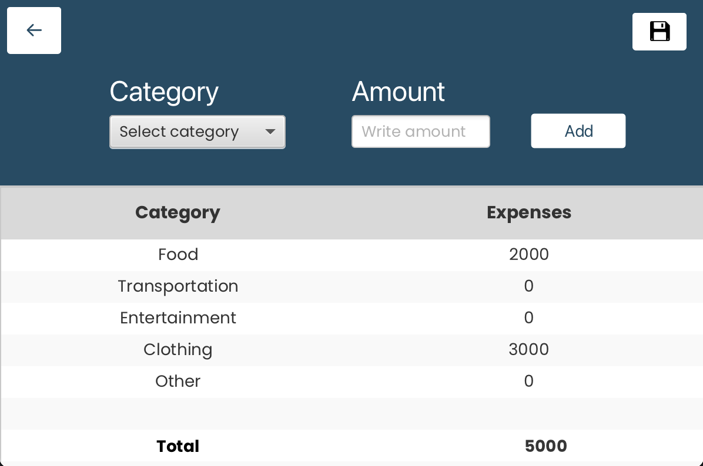

# Gruppe 2340 -  budsjett app

## Funksjonalitet
Vår app baserer seg på et budsjett, hvor brukeren kan velge/legge til ulike kategorier
som mat, klær, transport, osv. Brukeren kan legge til inntekter og utgifter, og appen skal da kunne
regne ut summen innenfor hver kategori og totalsumm.

Dette skal da lagres til skyen via REST API, slik at brukeren kan logge seg inn på en annen enhet og fortsatt
kunne se budsjettet sitt.

### Kjøre tester
For å kjøre testene til appen må REST applikasjonen først startes lokalt, det kan gjøres
enten ved å cd inn i springrest og kjøre **mvn spring-boot:run**, eller kjøre: **mvn spring-boot:run -f ./springrest**
fra budget folderen.  

Så kan **mvn test** kjøres fra budget folderen slik at testene gjennomføres 

### Appdesign

