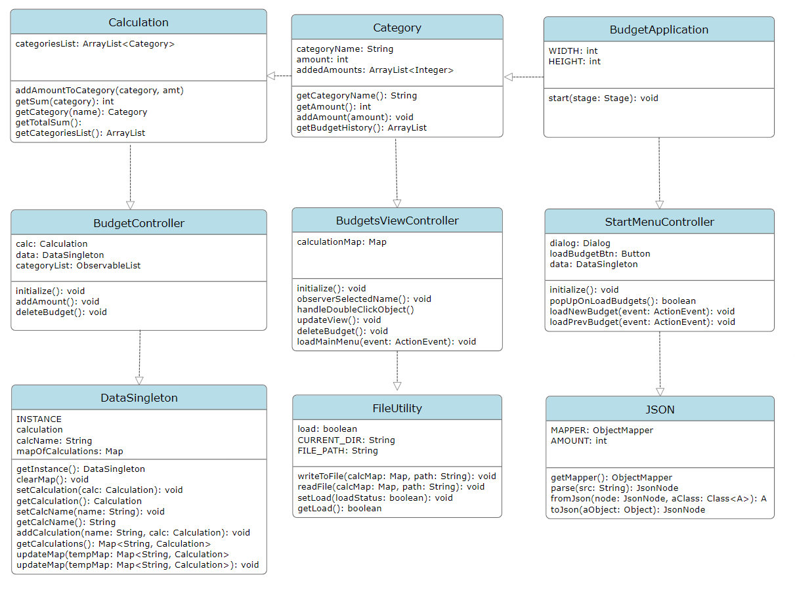
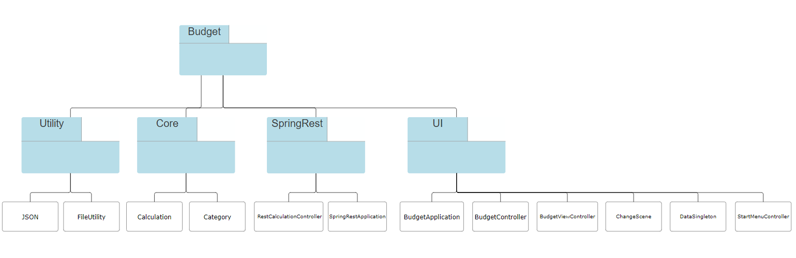
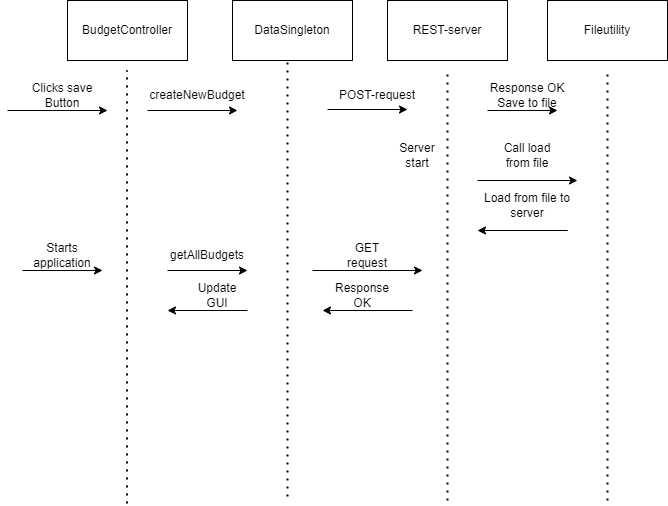

# Arkitektur
Vi har implementert MVC arkitektur (full tre-lags arkitektur) i prosjektet. Der kjernelogikken
og UI-et har blitt avskilt. Vi har også valgt å implementere en egen modul for filskriving, slik at
det er persistering av data mellom kjøring av appen, ved og ha et egnet bibliotek for dette (Jackson).
I tillegg har vi en ekstra modul for rest-serveren med Spring boot. Denne modulen inngår ikke i parent-modulen "Budget"
da spring boot kun kan ha en parent, og vi trenger Spring boot sin parent for at den skal fungere.
Vi har laget et plantUML diagram for å vise arkitekturen til prosjektet vårt:

## Diagrammer

### Klassediagram

### Pakkediagram

### Sekvensdiagram
