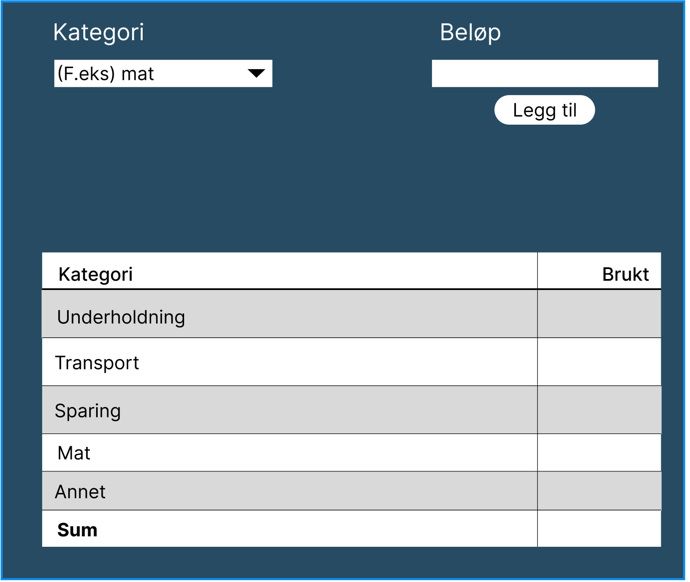

# Release 1 dokumentasjon

## Arbeidsfordeling: 

Christopher: 
- Initiel opprettelse av prosjektet
- Opprettelse av fxml-fil for å kunne velge mellom laste inn og lage ny instans av app
- Opprette fil- lagring og skriving funksjonalitet

Mats:
- Lage core logic for kalkulasjon og lagring
- Skrive dokumentasjon for appen, og for release 1
- Opprette issues og milestone for release 1
- Hjelpe med lage filskrivings funksjonalitet

Eirik:
- Lage core logic for kalkulasjon og lagring 
- Lage css styling for appen
- Lage fil- lagring og skriving funksjonalitet

Fredrik:

- Lage tester for core logikken
- Sette opp maven og eclipse che for prosjektet
---
## Bruk av git
Ettersom prosjektet har blitt delt opp i issues, har vi kunne brukt branches for å jobbe med hver vår del av prosjektet.
Uten å møte på overskrivning av andres kode. 

Vi har også tatt i bruk merge requests for å kvalitetssikre at koden som blir lagt til i master er godkjent av en annen i gruppen.

---
## Design
Når vi fant ut av ide til hva vi ville at appen skulle være, valgte vi å designe den i Figma først.
Slik at vi var enige om hvordan vi ville at appen skulle fungere 
og at vi kunne se for oss hva som trengtes å impementeres i koden.

Designet kan sees her:

## Testing 
For første iterasjon har vi valgt å teste core logikken i appen.
Vi tester de mest sentrale funksjonene i appen, som å legge til utgifter, legge til inntekter, og å få totalsummen.
Testene er skrevet i Junit. Når vi kjører Jacoco får vi god dekningsgrad på dem.

## Filhåndtering
For at appen skal kunne lagre data, og senere vise frem denne dataen. Har vi implementert lesing- og skriving til fil. 
Logikken finnes inne i [FileUtility](../../src/main/java/utility/FileUtility.java) filen. 
Fildataen lagres i en txt fil, og vi valgte et enkelt oppsett av filen
slik at lesing av filen er lett for brukere å lese og forstå.

