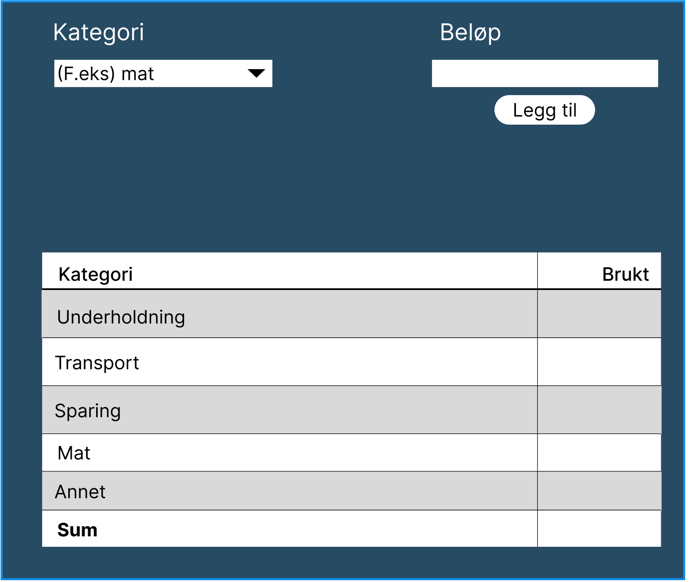

# Beskrivelse av appen
Appen er laget for å organisere utgiftene til en bruker etter kategorier 
og få en klar oversikt over 
hvor mye penger de har brukt i hver kategori.

## Appens forbruk
Appen skal brukes av privatpersoner som ønsker å få en oversikt over sine utgifter innenfor ulike kategorier, 
og kunne ha en oversikt over hvor mye de totalt har brukt.

## Appens funksjonalitet
Vår app baserer seg på et budsjett, hvor brukeren kan velge/legge til ulike kategorier
som mat, klær, transport, osv. Brukeren kan legge til inntekter og utgifter, og appen skal da kunne
regne ut summen innenfor hver kategori og totalsumm.
Dette skal da lagres til skyen via REST API, slik at brukeren kan logge seg inn på en annen enhet og fortsatt
kunne se budsjettet sitt.

Her er en skisse av hvordan appen kan se ut når den er ferdig:

---
## Brukerhistorie
Som privatperson ønsker jeg å kunne legge til det jeg har brukt av penger, slik at jeg kan få en oversikt over mine totale utgifter.

### Løsningsbeskrivense
**Bruker må kunne**:

- Velge hvilken kategori utgiften tilhører.
- Skrive inn beløp på utgiften, og legge det til.
- Se oversikt over alle utgifter fordelt på kategoriene, samt en totalsum.

