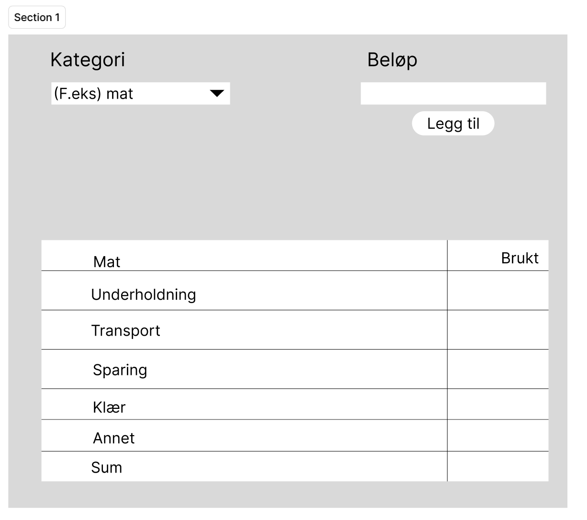

# Beskrivelse av appen

## Appens forbruk

## Appens funksjonalitet
Vår app baserer seg på et budsjett, hvor brukeren kan velge/legge til ulike kategorier
som mat, klær, transport, osv. Brukeren kan legge til inntekter og utgifter, og appen skal da kunne
regne ut summen innenfor hver kategori og totalsumm.
Dette skal da lagres til skyen via REST API, slik at brukeren kan logge seg inn på en annen enhet og fortsatt
kunne se budsjettet sitt.

Her er en skisse av hvordan appen kan se ut når den er ferdig:

